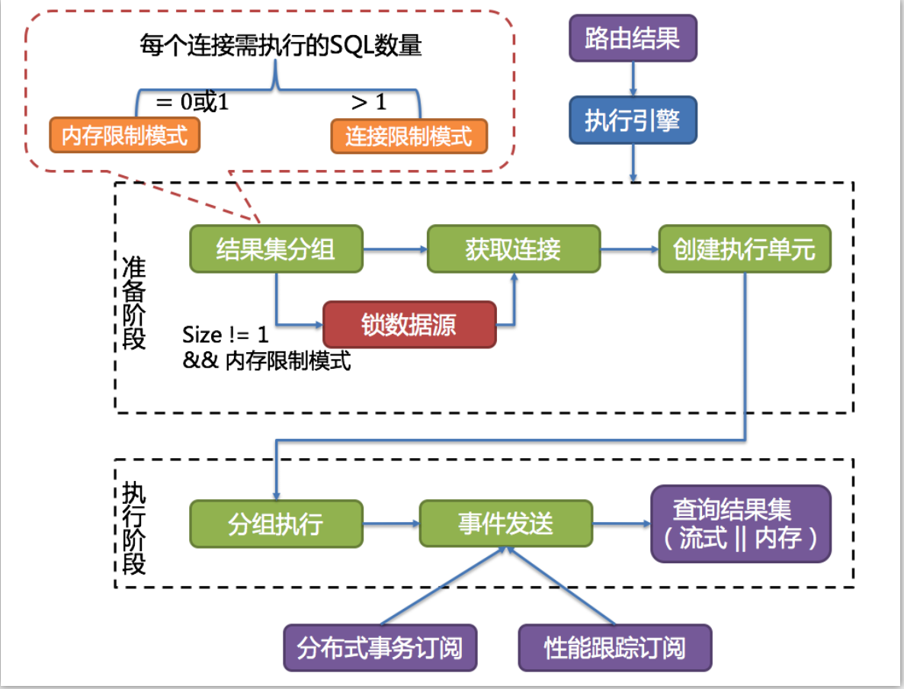

#                   ShardingSphere

# 概述

ShardingSphere是一套开源的分布式数据库中间件解决方案组成的生态圈,  它由Sharding-JDBC 、Sharding-Proxy和Sharding-Sidecar (计划中) 这三款相互独立的产品组成.  他们均提供标准化的数据分片、分布式事物和数据库治理功能, 可适用于Java同构、异构语言、云原生等各种多样化的应用场景.

ShardingSphere定位为关系型数据库中间件, 旨在充分合理地在分布式的场景下利用关系型数据库的计算和存储能力, 而并非实现一个全新的关系型数据库.  它与NoSQL和NewSQL是并存而非互斥的关系.  NoSQL和NewSQL作为新技术探索的前沿, 放眼未来, 拥抱变化 是非常值得推荐的. 反之也可以用另一种思路看待问题, 放眼未来, 关注不变的东西, 进而抓住事物的本质.  关系型数据库当今依然有巨大的市场, 是各个公司核心业务的基石, 未来也难以撼动, 我们目前阶段更加关注在原有基础上的增量, 而非颠覆.

ShardingSphere目前已经进入[Apache孵化器](http://incubator.apache.org/projects/shardingsphere.html)


## 简介

### Sharding-JDBC

定位为轻量级Java框架, 在Java和JDBC层提供额外的服务.  它使用客户端直连数据库, 以jar包形式提供服务, 无需额外部署和依赖, 可理解为增强型的JDBC驱动,  完全兼容JDBC和各种ORM框架.

- 适用于任何基于Java的ORM框架，如：JPA, Hibernate, Mybatis, Spring JDBC Template或直接使用JDBC。
- 基于任何第三方的数据库连接池，如：DBCP, C3P0, BoneCP, Druid, HikariCP等。
- 支持任意实现JDBC规范的数据库。目前支持MySQL，Oracle，SQLServer和PostgreSQL。


### Sharding-Proxy

定位为透明化的数据库代理端, 提供封装了数据库二进制协议的服务端版本, 对于完成对异构语言的支持.  目前首先提供MySQL版本,  它可以支持任何兼容MySQL协议的访问客户端(如: MySQL Command Client, MySQL Workbench等) 操作数据, 对DBA更加友好.

- 向应用程序完全透明，可直接当做MySQL使用。
- 适用于任何兼容MySQL协议的客户端。


### Sharding-Sidecar（TODO）

定位为Kubernetes的云原生数据库代理，以Sidecar的形式代理所有对数据库的访问。 通过无中心、零侵入的方案提供与数据库交互的的啮合层，即Database Mesh，又可称数据网格。

Database Mesh的关注重点在于如何将分布式的数据访问应用与数据库有机串联起来，它更加关注的是交互，是将杂乱无章的应用与数据库之间的交互有效的梳理。使用Database Mesh，访问数据库的应用和数据库终将形成一个巨大的网格体系，应用和数据库只需在网格体系中对号入座即可，它们都是被啮合层所治理的对象。


|            | *Sharding-JDBC* | *Sharding-Proxy* | *Sharding-Sidecar* |
| :--------- | :-------------: | :--------------: | :----------------: |
| 数据库     |      任意       |      MySQL       |       MySQL        |
| 连接消耗数 |       高        |        低        |         高         |
| 异构语言   |     仅Java      |       任意       |        任意        |
| 性能       |     损耗低      |     损耗略高     |       损耗低       |
| 无中心化   |       是        |        否        |         是         |
| 静态入口   |       无        |        有        |         无         |

### 混合架构

Sharding-JDBC采用无中心化架构，适用于Java开发的高性能的轻量级

[^OLTP是传统的关系型数据库的主要应用，主要是基本的、日常的事务处理，记录即时的增、删、改、查]: 

应用；Sharding-Proxy提供静态入口以及异构语言的支持，适用于OLAP应用以及对分片数据库进行管理和运维的场景。

ShardingSphere是多接入端共同组成的生态圈。 通过混合使用Sharding-JDBC和Sharding-Proxy，并采用同一注册中心统一配置分片策略，能够灵活的搭建适用于各种场景的应用系统，架构师可以更加自由的调整适合于当前业务的最佳系统架构。


### 功能列表

#### 数据分片

- 分库 & 分表
- 读写分离
- 分片策略定制化
- 无中心化分布式主键

#### 分布式事务

- 标准化事务接口
- XA强一致事务
- 柔性事务

#### 数据库治理

- 配置动态化
- 编排 & 治理
- 数据脱敏
- 可视化链路追踪
- 弹性伸缩(规划中)

### 项目状态


# 概念&功能

## 数据分片

### 背景

传统的将数据集中存储至单一数据节点的解决方案，在性能、可用性和运维成本这三方面已经难于满足互联网的海量数据场景。

从性能方面来说，由于关系型数据库大多采用B+树类型的索引，在数据量超过阈值的情况下，索引深度的增加也将使得磁盘访问的IO次数增加，进而导致查询性能的下降；同时，高并发访问请求也使得集中式数据库成为系统的最大瓶颈。

从可用性的方面来讲，服务化的无状态性，能够达到较小成本的随意扩容，这必然导致系统的最终压力都落在数据库之上。而单一的数据节点，或者简单的主从架构，已经越来越难以承担。数据库的可用性，已成为整个系统的关键。

从运维成本方面考虑，当一个数据库实例中的数据达到阈值以上，对于DBA的运维压力就会增大。数据备份和恢复的时间成本都将随着数据量的大小而愈发不可控。一般来讲，单一数据库实例的数据的阈值在1TB之内，是比较合理的范围。

在传统的关系型数据库无法满足互联网场景需要的情况下，将数据存储至原生支持分布式的NoSQL的尝试越来越多。 但NoSQL对SQL的不兼容性以及生态圈的不完善，使得它们在与关系型数据库的博弈中始终无法完成致命一击，而关系型数据库的地位却依然不可撼动。

数据分片指按照某个维度将存放在单一数据库中的数据分散地存放至多个数据库或表中以达到提升性能瓶颈以及可用性的效果。 数据分片的有效手段是对关系型数据库进行分库和分表。分库和分表均可以有效的避免由数据量超过可承受阈值而产生的查询瓶颈。 除此之外，分库还能够用于有效的分散对数据库单点的访问量；分表虽然无法缓解数据库压力，但却能够提供尽量将分布式事务转化为本地事务的可能，一旦涉及到跨库的更新操作，分布式事务往往会使问题变得复杂。 使用多主多从的分片方式，可以有效的避免数据单点，从而提升数据架构的可用性。

通过分库和分表进行数据的拆分来使得各个表的数据量保持在阈值以下，以及对流量进行疏导应对高访问量，是应对高并发和海量数据系统的有效手段。 数据分片的拆分方式又分为垂直分片和水平分片。

#### 垂直分片

按照业务拆分的方式称为垂直分片，又称为纵向拆分，它的核心理念是专库专用。 在拆分之前，一个数据库由多个数据表构成，每个表对应着不同的业务。而拆分之后，则是按照业务将表进行归类，分布到不同的数据库中，从而将压力分散至不同的数据库。 下图展示了根据业务需要，将用户表和订单表垂直分片到不同的数据库的方案。


垂直分片往往需要对架构和设计进行调整。通常来讲，是来不及应对互联网业务需求快速变化的；而且，它也并无法真正的解决单点瓶颈。 垂直拆分可以缓解数据量和访问量带来的问题，但无法根治。如果垂直拆分之后，表中的数据量依然超过单节点所能承载的阈值，则需要水平分片来进一步处理。

#### 水平分片

水平分片又称为横向拆分。 相对于垂直分片，它不再将数据根据业务逻辑分类，而是通过某个字段（或某几个字段），根据某种规则将数据分散至多个库或表中，每个分片仅包含数据的一部分。 例如：根据主键分片，偶数主键的记录放入0库（或表），奇数主键的记录放入1库（或表），如下图所示。


水平分片从理论上突破了单机数据量处理的瓶颈，并且扩展相对自由，是分库分表的标准解决方案。

### 挑战

虽然数据分片解决了性能、可用性以及单点备份恢复等问题，但分布式的架构在获得了收益的同时，也引入了新的问题。

面对如此散乱的分库分表之后的数据，应用开发工程师和数据库管理员对数据库的操作变得异常繁重就是其中的重要挑战之一。他们需要知道数据需要从哪个具体的数据库的分表中获取。

另一个挑战则是，能够正确的运行在单节点数据库中的SQL，在分片之后的数据库中并不一定能够正确运行。例如，分表导致表名称的修改，或者分页、排序、聚合分组等操作的不正确处理。

跨库事务也是分布式的数据库集群要面对的棘手事情。 合理采用分表，可以在降低单表数据量的情况下，尽量使用本地事务，善于使用同库不同表可有效避免分布式事务带来的麻烦。 在不能避免跨库事务的场景，有些业务仍然需要保持事务的一致性。 而基于XA的分布式事务由于在并发度高的场景中性能无法满足需要，并未被互联网巨头大规模使用，他们大多采用最终一致性的柔性事务代替强一致事务。

### 目标

**尽量透明化分库分表所带来的影响，让使用方尽量像使用一个数据库一样使用水平分片之后的数据库集群，是ShardingSphere数据分片模块的主要设计目标。**

### 核心概念

本小节主要介绍数据分片的核心概念，主要包括：

- SQL核心概念
- 分片核心概念
- 配置核心概念

#### SQL

##### 逻辑表

水平拆分的数据库（表）的相同逻辑和数据结构表的总称。例：订单数据根据主键尾数拆分为10张表，分别是`t_order_0`到`t_order_9`，他们的逻辑表名为`t_order`。

##### 真实表

在分片的数据库中真实存在的物理表。即上个示例中的`t_order_0`到`t_order_9`。

##### 数据节点

数据分片的最小单元。由数据源名称和数据表组成，例：`ds_0.t_order_0`。

##### 绑定表

指分片规则一致的主表和子表。例如：`t_order`表和`t_order_item`表，均按照`order_id`分片，则此两张表互为绑定表关系。绑定表之间的多表关联查询不会出现笛卡尔积关联，关联查询效率将大大提升。举例说明，如果SQL为：

```sql
SELECT i.* FROM t_order o JOIN t_order_item i ON o.order_id=i.order_id WHERE o.order_id in (10, 11);
```

在不配置绑定表关系时，假设分片键`order_id`将数值10路由至第0片，将数值11路由至第1片，那么路由后的SQL应该为4条，它们呈现为笛卡尔积：

```
SELECT i.* FROM t_order_0 o JOIN t_order_item_0 i ON o.order_id=i.order_id WHERE o.order_id in (10, 11);

SELECT i.* FROM t_order_0 o JOIN t_order_item_1 i ON o.order_id=i.order_id WHERE o.order_id in (10, 11);

SELECT i.* FROM t_order_1 o JOIN t_order_item_0 i ON o.order_id=i.order_id WHERE o.order_id in (10, 11);

SELECT i.* FROM t_order_1 o JOIN t_order_item_1 i ON o.order_id=i.order_id WHERE o.order_id in (10, 11);
```

在配置绑定表关系后，路由的SQL应该为2条：

```
SELECT i.* FROM t_order_0 o JOIN t_order_item_0 i ON o.order_id=i.order_id WHERE o.order_id in (10, 11);

SELECT i.* FROM t_order_1 o JOIN t_order_item_1 i ON o.order_id=i.order_id WHERE o.order_id in (10, 11);
```

其中`t_order`在FROM的最左侧，ShardingSphere将会以它作为整个绑定表的主表。 所有路由计算将会只使用主表的策略，那么`t_order_item`表的分片计算将会使用`t_order`的条件。故绑定表之间的分区键要完全相同。

##### 广播表

指所有的分片数据源中都存在的表，表结构和表中的数据在每个数据库中均完全一致。适用于数据量不大且需要与海量数据的表进行关联查询的场景，例如：字典表。

#### 分片

##### 分片键

用于分片的数据库字段，是将数据库(表)水平拆分的关键字段。例：将订单表中的订单主键的尾数取模分片，则订单主键为分片字段。 SQL中如果无分片字段，将执行全路由，性能较差。 除了对单分片字段的支持，ShardingSphere也支持根据多个字段进行分片。

##### 分片算法

通过分片算法将数据分片，支持通过`=`、`BETWEEN`和`IN`分片。分片算法需要应用方开发者自行实现，可实现的灵活度非常高。

目前提供4种分片算法。由于分片算法和业务实现紧密相关，因此并未提供内置分片算法，而是通过分片策略将各种场景提炼出来，提供更高层级的抽象，并提供接口让应用开发者自行实现分片算法。

###### 精确分片算法

对应PerciseShardingAlgorithm, 用于处理使用单一键作为分片键的 = 与 IN 进行分片的场景. 需要配合StandardShardingStrategy使用.

###### 范围分片算法

对应RangeShardingAlgorithm, 用于处理使用单一键作为分片键的 BETWEEN AND 进行分片的场景.  需要配合StandardShardingStrategy使用.

###### 复合分片算法

对应ComplexKeysShardingAlgorithm, 用于处理使用多键作为分片键进行分片的场景.  包含多个分片键的逻辑较复杂,  需要应用开发者自行处理其中的复杂度. 需要配合ComplexShardingStrategy使用.

###### Hint分片算法

对应HintShardingAlgorithm, 用于处理使用Hint行分片的场景.  需要配合HintShardingStrategy使用.

##### 分片策略

包含分片键和分片算法,  由于分片算法的独立性, 将其独立抽离. 真正可用于分片操作的是 分片键+分片算法,  也就是分片策略.  目前提供5中分片策略.

###### 标准分片策略

对应StandardShardingStrategy.  提供对SQL语句中的 = , IN 和 BETWEEN AND 进行分片操作支持. StandardShardingStrategy只支持单分片键. 提供PerciseShardingAlgorithm和RangeShardingAlgorithm两个分片算法.  PerciseShardingAlgorithm是必选的,  用于处理 = 和 IN 的分片.  RangeShardingAlgorithm 是可选的.  用于处理 BETWEEN AND 分片, 如果不配置 RangeShardingAlgorithm , SQL中的BETWEEN AND 将安装全库路由处理.

###### 复合分片策略

对应ComplexShardingShrategy. 复合分片策略。提供对SQL语句中的=, IN和BETWEEN AND的分片操作支持。ComplexShardingStrategy支持多分片键，由于多分片键之间的关系复杂，因此并未进行过多的封装，而是直接将分片键值组合以及分片操作符透传至分片算法，完全由应用开发者实现，提供最大的灵活度。

###### 行表达式分片策略

对应InlineShardingStrategy。使用Groovy的表达式，提供对SQL语句中的=和IN的分片操作支持，只支持单分片键。对于简单的分片算法，可以通过简单的配置使用，从而避免繁琐的Java代码开发，如: `t_user_$->{u_id % 8}` 表示t_user表根据u_id模8，而分成8张表，表名称为`t_user_0`到`t_user_7`。

###### Hint分片策略

对应HintShardingStrategy.  通过Hint而非SQL解析的分片方式.

###### 不分片策略

对应NoneShardingStrategy, 对应不分片的策略.

##### SQL Hint

对于分片字段非SQL决定，而由其他外置条件决定的场景，可使用SQL Hint灵活的注入分片字段。例：内部系统，按照员工登录主键分库，而数据库中并无此字段。SQL Hint支持通过Java API和SQL注释(待实现)两种方式使用。

#### 配置

##### 分片规则

分片规则配置的总入口。包含数据源配置、表配置、绑定表配置以及读写分离配置等。

##### 数据源配置

真实数据源列表

##### 表配置

逻辑表名称, 数据节点与分表规则的配置.

##### 数据节点配置

用于配置 逻辑表与真实表的映射关系.  可分为均匀分布和自定义分布两种形式.

- 均匀分布

指数据表在每个数据源内呈现均匀分布的态势,  例如:

```
db0
├── t_order0 
└── t_order1 
db1
├── t_order0 
└── t_order1
```

那么数据节点配置如下:

```
db0.t_order0, db0.t_order1, db1.t_order0, db1.t_order1
```

-    自定义分布

指数据表呈现有特定规则的分布, 例如:

```
db0
  ├── t_order0 
  └── t_order1 
db1
  ├── t_order2
  ├── t_order3
  └── t_order4
```

那么数据节点的配置如下：

```
db0.t_order0, db0.t_order1, db1.t_order2, db1.t_order3, db1.t_order4
```

##### 分片策略配置

对于分片策略存有数据源分片策略和表分片策略两种维度。

-    数据源分片策略

对应于DatabaseShardingStrategy. 用于配置数据被分配的目标数据源.

- 表分配策略

对应于TableShardingStrategy.  用于配置数据被分配的目标表.  该目标表存在与该数据的目标数据源内。故表分片策略是依赖与数据源分片策略的结果的。

两种策略的API完全相同。

##### 自增主键生成策略

通过在客户端生成自增主键替换以数据库原生自增主键的方式，做到分布式主键无重复。

### 内核剖析

ShardingSphere的3个产品的数据分片主要流程是完全一致的。 核心由

`SQL解析 => 执行器优化 => SQL路由 => SQL改写 => SQL执行 => 结果归并`

的流程组成。


- SQL解析

分为词法解析和语法解析。 先通过词法解析器将SQL拆分为一个个不可再分的单词。再使用语法解析器对SQL进行理解，并最终提炼出解析上下文。 解析上下文包括表、选择项、排序项、分组项、聚合函数、分页信息、查询条件以及可能需要修改的占位符的标记。

执行器优化

合并和优化分片条件，如OR等。

- SQL路由

根据解析上下文匹配用户配置的分片策略，并生成路由路径。目前支持分片路由和广播路由。

- SQL改写

将SQL改写为在真实数据库中可以正确执行的语句。SQL改写分为正确性改写和优化改写。

- SQL执行

同步多线程执行器异步执行.

- 结果归并

将多个执行结果集归并以便于通过统一的JDBC接口输出。结果归并包括流式归并、内存归并和使用装饰者模式的追加归并这几种方式。

#### 解析引擎

相对于其他编程语言，SQL是比较简单的。 不过，它依然是一门完善的编程语言，因此对SQL的语法进行解析，与解析其他编程语言（如：Java语言、C语言、Go语言等）并无本质区别。

##### 抽象语法树

解析过程分为词法解析和语法解析。 词法解析器用于将SQL拆解为不可再分的原子符号，称为Token。并根据不同数据库方言所提供的字典，将其归类为关键字，表达式，字面量和操作符。 再使用语法解析器将SQL转换为抽象语法树。

例如, 以下 SQL:

```sql
SELECT id, name FROM t_user WHERE status = 'ACTIVE' AND age > 18
```

解析之后的为抽象语法树见下图。


为了便于理解，抽象语法树中的关键字的Token用绿色表示，变量的Token用红色表示，灰色表示需要进一步拆分。

最后，通过对抽象语法树的遍历去提炼分片所需的上下文，并标记有可能需要改写的位置。 供分片使用的解析上下文包含查询选择项（Select Items）、表信息（Table）、分片条件（Sharding Condition）、自增主键信息（Auto increment Primary Key）、排序信息（Order By）、分组信息（Group By）以及分页信息（Limit、Rownum、Top）。 SQL的一次解析过程是不可逆的，一个个Token按SQL原本的顺序依次进行解析，性能很高。 考虑到各种数据库SQL方言的异同，在解析模块提供了各类数据库的SQL方言字典。

##### SQL解析引擎

SQL解析作为分库分表类产品的核心，其性能和兼容性是最重要的衡量指标。 ShardingSphere的SQL解析器经历了3代产品的更新迭代。

第一代SQL解析器为了追求性能与快速实现，在1.4.x之前的版本使用Druid作为SQL解析器。经实际测试，它的性能远超其它解析器。

第二代SQL解析器从1.5.x版本开始，ShardingSphere采用完全自研的SQL解析引擎。 由于目的不同，ShardingSphere并不需要将SQL转为一颗完全的抽象语法树，也无需通过访问器模式进行二次遍历。它采用对SQL`半理解`的方式，仅提炼数据分片需要关注的上下文，因此SQL解析的性能和兼容性得到了进一步的提高。

第三代SQL解析器则从3.0.x版本开始，ShardingSphere尝试使用ANTLR作为SQL解析的引擎，并计划根据`DDL -> TCL -> DAL –> DCL -> DML –>DQL`这个顺序，依次替换原有的解析引擎，目前仍处于替换迭代中。 使用ANTLR的原因是希望ShardingSphere的解析引擎能够更好的对SQL进行兼容。对于复杂的表达式、递归、子查询等语句，虽然ShardingSphere的分片核心并不关注，但是会影响对于SQL理解的友好度。 经过实例测试，ANTLR解析SQL的性能比自研的SQL解析引擎慢3-10倍左右。为了弥补这一差距，ShardingSphere将使用`PreparedStatement`的SQL解析的语法树放入缓存。 因此建议采用`PreparedStatement`这种SQL预编译的方式提升性能。

第三代SQL解析引擎的整体结构划分如下图所示。


#### 路由引擎

根据解析上下文匹配数据库和表的分片策略，并生成路由路径。 对于携带分片键的SQL，根据分片键的不同可以划分为单片路由(分片键的操作符是等号)、多片路由(分片键的操作符是IN)和范围路由(分片键的操作符是BETWEEN)。 不携带分片键的SQL则采用广播路由。

分片策略通常可以采用由数据库内置或由用户方配置。 数据库内置的方案较为简单，内置的分片策略大致可分为尾数取模、哈希、范围、标签、时间等。 由用户方配置的分片策略则更加灵活，可以根据使用方需求定制复合分片策略。 如果配合数据自动迁移来使用，可以做到无需用户关注分片策略，自动由数据库中间层分片和平衡数据即可，进而做到使分布式数据库具有的弹性伸缩的能力。 在ShardingSphere的线路规划中，弹性伸缩将于4.x开启。

##### 分片路由

用于根据分片键进行路由的场景，又细分为直接路由、标准路由和笛卡尔积路由这3种类型。

###### 直接路由

满足直接路由的条件相对苛刻，它需要通过Hint（使用HintAPI直接指定路由至库表）方式分片，并且是只分库不分表的前提下，则可以避免SQL解析和之后的结果归并。 因此它的兼容性最好，可以执行包括子查询、自定义函数等复杂情况的任意SQL。直接路由还可以用于分片键不在SQL中的场景。例如，设置用于数据库分片的键为`3`，

```
hintManager.setDatabaseShardingValue(3);
```

假如路由算法为`value % 2`，当一个逻辑表`t_order`对应2个真实表t_order_0`和`t_order_1`时，路由后SQL将在`t_order_1`上执行。下方是使用API的代码样例：

```java
String sql = "SELECT * FROM t_order";
try (
        HintManager hintManager = HintManager.getInstance();
        Connection conn = dataSource.getConnection();
        PreparedStatement pstmt = conn.prepareStatement(sql)) {
    hintManager.setDatabaseShardingValue(3);
    try (ResultSet rs = pstmt.executeQuery()) {
        while (rs.next()) {
            //...
        }
    }
}
```

###### 标准路由

标准路由是ShardingSphere最为推荐使用的分片方式，它的适用范围是不包含关联查询或仅包含绑定表之间关联查询的SQL。 当分片运算符是等于号时，路由结果将落入单库（表），当分片运算符是BETWEEN或IN时，则路由结果不一定落入唯一的库（表），因此一条逻辑SQL最终可能被拆分为多条用于执行的真实SQL。 举例说明，如果按照`order_id`的奇数和偶数进行数据分片，一个单表查询的SQL如下：

```sql
SELECT * FROM t_order WHERE order_id IN (1, 2);
```

那么路由的结果应为：

```sql
SELECT * FROM t_order_0 WHERE order_id IN (1, 2);
SELECT * FROM t_order_1 WHERE order_id IN (1, 2);
```

绑定表的关联查询与单表查询复杂度和性能相当。举例说明，如果一个包含绑定表的关联查询的SQL如下：

```sql
SELECT * FROM t_order o JOIN t_order_item i ON o.order_id=i.order_id  WHERE order_id IN (1, 2);
```

那么路由的结果应为：

```sql
SELECT * FROM t_order_0 o JOIN t_order_item_0 i ON o.order_id=i.order_id  WHERE order_id IN (1, 2);
SELECT * FROM t_order_1 o JOIN t_order_item_1 i ON o.order_id=i.order_id  WHERE order_id IN (1, 2);
```

###### 笛卡尔路由

笛卡尔路由是最复杂的情况，它无法根据绑定表的关系定位分片规则，因此非绑定表之间的关联查询需要拆解为笛卡尔积组合执行。 如果上个示例中的SQL并未配置绑定表关系，那么路由的结果应为：

```sql
SELECT * FROM t_order_0 o JOIN t_order_item_0 i ON o.order_id=i.order_id  WHERE order_id IN (1, 2);
SELECT * FROM t_order_0 o JOIN t_order_item_1 i ON o.order_id=i.order_id  WHERE order_id IN (1, 2);
SELECT * FROM t_order_1 o JOIN t_order_item_0 i ON o.order_id=i.order_id  WHERE order_id IN (1, 2);
SELECT * FROM t_order_1 o JOIN t_order_item_1 i ON o.order_id=i.order_id  WHERE order_id IN (1, 2);
```

笛卡尔路由查询性能较低，需谨慎使用。

##### 广播路由

对于不携带分片键的SQL，则采取广播路由的方式。根据SQL类型又可以划分为全库表路由、全库路由、全实例路由、单播路由和阻断路由这5种类型。

###### 全库表路由

全库表路由用于处理对数据库中与其逻辑表相关的所有真实表的操作，主要包括不带分片键的DQL和DML，以及DDL等。例如：

```sql
SELECT * FROM t_order WHERE good_prority IN (1, 10);
```

则会遍历所有数据库中的所有表，逐一匹配逻辑表和真实表名，能够匹配得上则执行。路由后成为

```sql
SELECT * FROM t_order_0 WHERE good_prority IN (1, 10);
SELECT * FROM t_order_1 WHERE good_prority IN (1, 10);
SELECT * FROM t_order_2 WHERE good_prority IN (1, 10);
SELECT * FROM t_order_3 WHERE good_prority IN (1, 10);
```

###### 全库路由

全库路由用于处理对数据库的操作，包括用于库设置的SET类型的数据库管理命令，以及TCL这样的事务控制语句。 在这种情况下，会根据逻辑库的名字遍历所有符合名字匹配的真实库，并在真实库中执行该命令，例如：

```sql
SET autocommit=0;
```

在`t_order`中执行，`t_order`有2个真实库。则实际会在`t_order_0`和`t_order_1`上都执行这个命令。

###### 全实例路由

全实例路由用于DCL操作，授权语句针对的是数据库的实例。无论一个实例中包含多少个Schema，每个数据库的实例只执行一次。例如：

```sql
CREATE USER customer@127.0.0.1 identified BY '123';
```

这个命令将在所有的真实数据库实例中执行，以确保customer用户可以访问每一个实例。

###### 单播路由

单播路由用于获取某一真实表信息的场景，它仅需要从任意库中的任意真实表中获取数据即可。例如：

```sql
DESCRIBE t_order;
```

t_order的两个真实表t_order_0，t_order_1的描述结构相同，所以这个命令在任意真实表上选择执行一次。

###### 阻断路由

阻断路由用于屏蔽SQL对数据库的操作，例如：

```sql
USE order_db;
```

这个命令不会在真实数据库中执行，因为ShardingSphere采用的是逻辑Schema的方式，无需将切换数据库Schema的命令发送至数据库中。

路由引擎的整体结构划分如下图。


#### 改写引擎

工程师面向逻辑库与逻辑表书写的SQL，并不能够直接在真实的数据库中执行，SQL改写用于将逻辑SQL改写为在真实数据库中可以正确执行的SQL。 它包括正确性改写和优化改写两部分。

##### 正确性改写

在包含分表的场景中，需要将分表配置中的逻辑表名称改写为路由之后所获取的真实表名称。仅分库则不需要表名称的改写。除此之外，还包括补列和分页信息修正等内容。

##### 标识符改写

需要改写的标识符包括表名称、索引名称以及Schema名称。

表名称改写是指将找到逻辑表在原始SQL中的位置，并将其改写为真实表的过程。表名称改写是一个典型的需要对SQL进行解析的场景。 从一个最简单的例子开始，若逻辑SQL为：

```sql
SELECT order_id FROM t_order WHERE order_id=1;
```

假设该SQL配置分片键order_id，并且order_id=1的情况，将路由至分片表1。那么改写之后的SQL应该为：

```sql
SELECT order_id FROM t_order_1 WHERE order_id=1;
```

在这种最简单的SQL场景中，是否将SQL解析为抽象语法树似乎无关紧要，只要通过字符串查找和替换就可以达到SQL改写的效果。 但是下面的场景，就无法仅仅通过字符串的查找替换来正确的改写SQL了：

```sql
SELECT order_id FROM t_order WHERE order_id=1 AND remarks=' t_order xxx';
```

正确改写的SQL应该是：

```sql
SELECT order_id FROM t_order_1 WHERE order_id=1 AND remarks=' t_order xxx';
```

而非：

```sql
SELECT order_id FROM t_order_1 WHERE order_id=1 AND remarks=' t_order_1 xxx';
```

由于表名之外可能含有表名称的类似字符，因此不能通过简单的字符串替换的方式去改写SQL。

下面再来看一个更加复杂的SQL改写场景：

```sql
SELECT t_order.order_id FROM t_order WHERE t_order.order_id=1 AND remarks=' t_order xxx';
```

上面的SQL将表名作为字段的标识符，因此在SQL改写时需要一并修改：

```sql
SELECT t_order_1.order_id FROM t_order_1 WHERE t_order_1.order_id=1 AND remarks=' t_order xxx';
```

而如果SQL中定义了表的别名，则无需连同别名一起修改，即使别名与表名相同亦是如此。例如：

```sql
SELECT t_order.order_id FROM t_order AS t_order WHERE t_order.order_id=1 AND remarks=' t_order xxx';
```

SQL改写则仅需要改写表名称就可以了：

```sql
SELECT t_order.order_id FROM t_order_1 AS t_order WHERE t_order.order_id=1 AND remarks=' t_order xxx';
```

索引名称是另一个有可能改写的标识符。 在某些数据库中（如MySQL），索引是以表为维度创建的，在不同的表中的索引是可以重名的； 而在另外的一些数据库中（如PostgreSQL），索引是以数据库为维度创建的，即使是作用在不同表上的索引，它们也要求其名称的唯一性。

在ShardingSphere中，管理Schema的方式与管理表如出一辙，它采用逻辑Schema去管理一组数据源。 因此，ShardingSphere需要将用户在SQL中书写的逻辑Schema替换为真实的数据库Schema。

ShardingSphere目前还不支持在DQL和DML语句中使用Schema。 它目前仅支持在数据库管理语句中使用Schema，例如：

```sql
SHOW COLUMNS FROM t_order FROM order_ds;
```

Schema的改写指的是将逻辑Schema采用单播路由的方式，改写为随机查找到的一个正确的真实Schema。

##### 补列

需要在查询语句中补列通常由两种情况导致。 第一种情况是ShardingSphere需要在结果归并时获取相应数据，但该数据并未能通过查询的SQL返回。 这种情况主要是针对GROUP BY和ORDER BY。结果归并时，需要根据`GROUP BY`和`ORDER BY`的字段项进行分组和排序，但如果原始SQL的选择项中若并未包含分组项或排序项，则需要对原始SQL进行改写。 先看一下原始SQL中带有结果归并所需信息的场景：

```sql
SELECT order_id, user_id FROM t_order ORDER BY user_id;
```

由于使用user_id进行排序，在结果归并中需要能够获取到user_id的数据，而上面的SQL是能够获取到user_id数据的，因此无需补列。

如果选择项中不包含结果归并时所需的列，则需要进行补列，如以下SQL：

```sql
SELECT order_id FROM t_order ORDER BY user_id;
```

由于原始SQL中并不包含需要在结果归并中需要获取的user_id，因此需要对SQL进行补列改写。补列之后的SQL是：

```sql
SELECT order_id, user_id AS ORDER_BY_DERIVED_0 FROM t_order ORDER BY user_id;
```

值得一提的是，补列只会补充缺失的列，不会全部补充，而且，在SELECT语句中包含 * 的SQL，也会根据表的元数据信息选择性补列。下面是一个较为复杂的SQL补列场景：

```sql
SELECT o.* FROM t_order o, t_order_item i WHERE o.order_id=i.order_id ORDER BY user_id, order_item_id;
```

我们假设只有t_order_item表中包含order_item_id列，那么根据表的元数据信息可知，在结果归并时，排序项中的user_id是存在于t_order表中的，无需补列；order_item_id并不在t_order中，因此需要补列。 补列之后的SQL是：

```sql
SELECT o.*, order_item_id AS ORDER_BY_DERIVED_0 FROM t_order o, t_order_item i WHERE o.order_id=i.order_id ORDER BY user_id, order_item_id;
```

补列的另一种情况是使用AVG聚合函数。在分布式的场景中，使用avg1 + avg2 + avg3 / 3计算平均值并不正确，需要改写为 (sum1 + sum2 + sum3) / (count1 + count2 + count3)。 这就需要将包含AVG的SQL改写为SUM和COUNT，并在结果归并时重新计算平均值。例如以下SQL：

```sql
SELECT AVG(price) FROM t_order WHERE user_id=1;
```

需要改写为：

```sql
SELECT COUNT(price) AS AVG_DERIVED_COUNT_0, SUM(price) AS AVG_DERIVED_ SUM _0 FROM t_order WHERE user_id=1;
```

然后才能够通过结果归并正确的计算平均值。

最后一种补列是在执行INSERT的SQL语句时，如果使用数据库自增主键，是无需写入主键字段的。 但数据库的自增主键是无法满足分布式场景下的主键唯一的，因此ShardingSphere提供了分布式自增主键的生成策略，并且可以通过补列，让使用方无需改动现有代码，即可将分布式自增主键透明的替换数据库现有的自增主键。 分布式自增主键的生成策略将在下文中详述，这里只阐述与SQL改写相关的内容。 举例说明，假设表t_order的主键是order_id，原始的SQL为：

```sql
INSERT INTO t_order (`field1`, `field2`) VALUES (10, 1);
```

可以看到，上述SQL中并未包含自增主键，是需要数据库自行填充的。ShardingSphere配置自增主键后，SQL将改写为：

```sql
INSERT INTO t_order (`field1`, `field2`, order_id) VALUES (10, 1, xxxxx);
```

改写后的SQL将在INSERT FIELD和INSERT VALUE的最后部分增加主键列名称以及自动生成的自增主键值。上述SQL中的`xxxxx`表示自动生成的自增主键值。

如果INSERT的SQL中并未包含表的列名称，ShardingSphere也可以根据判断参数个数以及表元信息中的列数量对比，并自动生成自增主键。例如，原始的SQL为：

```sql
INSERT INTO t_order VALUES (10, 1);
```

改写的SQL将只在主键所在的列顺序处增加自增主键即可：

```sql
INSERT INTO t_order VALUES (xxxxx, 10, 1);
```

自增主键补列时，如果使用占位符的方式书写SQL，则只需要改写参数列表即可，无需改写SQL本身。

##### 分页修正

从多个数据库获取分页数据与单数据库的场景是不同的。 假设每10条数据为一页，取第2页数据。在分片环境下获取LIMIT 10, 10，归并之后再根据排序条件取出前10条数据是不正确的。 举例说明，若SQL为：

```sql
SELECT score FROM t_score ORDER BY score DESC LIMIT 1, 2;
```


通过图中所示，想要取得两个表中共同的按照分数排序的第2条和第3条数据，应该是`95`和`90`。 由于执行的SQL只能从每个表中获取第2条和第3条数据，即从t_score_0表中获取的是`90`和`80`；从t_score_0表中获取的是`85`和`75`。 因此进行结果归并时，只能从获取的`90`，`80`，`85`和`75`之中进行归并，那么结果归并无论怎么实现，都不可能获得正确的结果。

正确的做法是将分页条件改写为`LIMIT 0, 3`，取出所有前两页数据，再结合排序条件计算出正确的数据。 下图展示了进行SQL改写之后的分页执行结果。


越获取偏移量位置靠后数据，使用LIMIT分页方式的效率就越低。 有很多方法可以避免使用LIMIT进行分页。比如构建行记录数量与行偏移量的二级索引，或使用上次分页数据结尾ID作为下次查询条件的分页方式等。

分页信息修正时，如果使用占位符的方式书写SQL，则只需要改写参数列表即可，无需改写SQL本身。

##### 批量拆分

在使用批量插入的SQL时，如果插入的数据是跨分片的，那么需要对SQL进行改写来防止将多余的数据写入到数据库中。 插入操作与查询操作的不同之处在于，查询语句中即使用了不存在于当前分片的分片键，也不会对数据产生影响；而插入操作则必须将多余的分片键删除。 举例说明，如下SQL：

```sql
INSERT INTO t_order (order_id, xxx) VALUES (1, 'xxx'), (2, 'xxx'), (3, 'xxx');
```

假设数据库仍然是按照order_id的奇偶值分为两片的，仅将这条SQL中的表名进行修改，然后发送至数据库完成SQL的执行 ，则两个分片都会写入相同的记录。 虽然只有符合分片查询条件的数据才能够被查询语句取出，但存在冗余数据的实现方案并不合理。因此需要将SQL改写为：

```sql
INSERT INTO t_order_0 (order_id, xxx) VALUES (2, 'xxx');
INSERT INTO t_order_1 (order_id, xxx) VALUES (1, 'xxx'), (3, 'xxx');
```

使用IN的查询与批量插入的情况相似，不过IN操作并不会导致数据查询结果错误。通过对IN查询的改写，可以进一步的提升查询性能。如以下SQL：

```sql
SELECT * FROM t_order WHERE order_id IN (1, 2, 3);
```

改写为：

```sql
SELECT * FROM t_order_0 WHERE order_id IN (2);
SELECT * FROM t_order_1 WHERE order_id IN (1, 3);
```

可以进一步的提升查询性能。ShardingSphere暂时还未实现此改写策略，目前的改写结果是：

```sql
SELECT * FROM t_order_0 WHERE order_id IN (1, 2, 3);
SELECT * FROM t_order_1 WHERE order_id IN (1, 2, 3);
```

虽然SQL的执行结果是正确的，但并未达到最优的查询效率。

##### 优化改写

优化改写的目的是在不影响查询正确性的情况下，对性能进行提升的有效手段。它分为单节点优化和流式归并优化。

###### 单节点优化

路由至单节点的SQL，则无需优化改写。 当获得一次查询的路由结果后，如果是路由至唯一的数据节点，则无需涉及到结果归并。因此补列和分页信息等改写都没有必要进行。 尤其是分页信息的改写，无需将数据从第1条开始取，大量的降低了对数据库的压力，并且节省了网络带宽的无谓消耗。

###### 流式归并优化

它仅为包含`GROUP BY`的SQL增加`ORDER BY`以及和分组项相同的排序项和排序顺序，用于将内存归并转化为流式归并。 在结果归并的部分中，将对流式归并和内存归并进行详细说明。

改写引擎的整体结构划分如下图所示。


#### 执行引擎

ShardingSphere采用一套自动化的执行引擎，负责将路由和改写完成之后的真实SQL安全且高效发送到底层数据源执行。 它不是简单地将SQL通过JDBC直接发送至数据源执行；也并非直接将执行请求放入线程池去并发执行。它更关注平衡数据源连接创建以及内存占用所产生的消耗，以及最大限度地合理利用并发等问题。 执行引擎的目标是自动化的平衡资源控制与执行效率。

##### 连接模式

从资源控制的角度看，业务方访问数据库的连接数量应当有所限制。 它能够有效地防止某一业务操作过多的占用资源，从而将数据库连接的资源耗尽，以致于影响其他业务的正常访问。 特别是在一个数据库实例中存在较多分表的情况下，一条不包含分片键的逻辑SQL将产生落在同库不同表的大量真实SQL，如果每条真实SQL都占用一个独立的连接，那么一次查询无疑将会占用过多的资源。

从执行效率的角度看，为每个分片查询维持一个独立的数据库连接，可以更加有效的利用多线程来提升执行效率。 为每个数据库连接开启独立的线程，可以将I/O所产生的消耗并行处理。为每个分片维持一个独立的数据库连接，还能够避免过早的将查询结果数据加载至内存。 独立的数据库连接，能够持有查询结果集游标位置的引用，在需要获取相应数据时移动游标即可。

以结果集游标下移进行结果归并的方式，称之为流式归并，它无需将结果数据全数加载至内存，可以有效的节省内存资源，进而减少垃圾回收的频次。 当无法保证每个分片查询持有一个独立数据库连接时，则需要在复用该数据库连接获取下一张分表的查询结果集之前，将当前的查询结果集全数加载至内存。 因此，即使可以采用流式归并，在此场景下也将退化为内存归并。

一方面是对数据库连接资源的控制保护，一方面是采用更优的归并模式达到对中间件内存资源的节省，如何处理好两者之间的关系，是ShardingSphere执行引擎需求解决的问题。 具体来说，如果一条SQL在经过ShardingSphere的分片后，需要操作某数据库实例下的200张表。 那么，是选择创建200个连接并行执行，还是选择创建一个连接串行执行呢？效率与资源控制又应该如何抉择呢？

针对上述场景，ShardingSphere提供了一种解决思路。 它提出了连接模式（Connection Mode）的概念，将其划分为内存限制模式（MEMORY_STRICTLY）和连接限制模式（CONNECTION_STRICTLY）这两种类型。

###### 内存限制模式

使用此模式的前提是，ShardingSphere对一次操作所耗费的数据库连接数量不做限制。 如果实际执行的SQL需要对某数据库实例中的200张表做操作，则对每张表创建一个新的数据库连接，并通过多线程的方式并发处理，以达成执行效率最大化。 并且在SQL满足条件情况下，优先选择流式归并，以防止出现内存溢出或避免频繁垃圾回收情况。

###### 连接限制模式

使用此模式的前提是，ShardingSphere严格控制对一次操作所耗费的数据库连接数量。 如果实际执行的SQL需要对某数据库实例中的200张表做操作，那么只会创建唯一的数据库连接，并对其200张表串行处理。 如果一次操作中的分片散落在不同的数据库，仍然采用多线程处理对不同库的操作，但每个库的每次操作仍然只创建一个唯一的数据库连接。 这样即可以防止对一次请求对数据库连接占用过多所带来的问题。该模式始终选择内存归并。

[^数据处理大致可以分成两大类：联机事务处理OLTP（on-line transaction processing）、联机分析处理OLAP（On-Line Analytical Processing）。OLTP是传统的关系型数据库的主要应用，主要是基本的、日常的事务处理，例如银行交易。OLAP是数据仓库系统的主要应用，支持复杂的分析操作，侧重决策支持，并且提供直观易懂的查询结果。]: 

内存限制模式适用于OLAP操作，可以通过放宽对数据库连接的限制提升系统吞吐量； 连接限制模式适用于OLTP操作，OLTP通常带有分片键，会路由到单一的分片，因此严格控制数据库连接，以保证在线系统数据库资源能够被更多的应用所使用，是明智的选择。

##### 自动化执行引擎

ShardingSphere最初将使用何种模式的决定权交由用户配置，让开发者依据自己业务的实际场景需求选择使用内存限制模式或连接限制模式。

这种解决方案将两难的选择的决定权交由用户，使得用户必须要了解这两种模式的利弊，并依据业务场景需求进行选择。 这无疑增加了用户对ShardingSphere的学习和使用的成本，并非最优方案。

这种一分为二的处理方案，将两种模式的切换交由静态的初始化配置，是缺乏灵活应对能力的。在实际的使用场景中，面对不同SQL以及占位符参数，每次的路由结果是不同的。 这就意味着某些操作可能需要使用内存归并，而某些操作则可能选择流式归并更优，具体采用哪种方式不应该由用户在ShardingSphere启动之前配置好，而是应该根据SQL和占位符参数的场景，来动态的决定连接模式。

为了降低用户的使用成本以及连接模式动态化这两个问题，ShardingSphere提炼出自动化执行引擎的思路，在其内部消化了连接模式概念。 用户无需了解所谓的内存限制模式和连接限制模式是什么，而是交由执行引擎根据当前场景自动选择最优的执行方案。

自动化执行引擎将连接模式的选择粒度细化至每一次SQL的操作。 针对每次SQL请求，自动化执行引擎都将根据其路由结果，进行实时的演算和权衡，并自主地采用恰当的连接模式执行，以达到资源控制和效率的最优平衡。 针对自动化的执行引擎，用户只需配置maxConnectionSizePerQuery即可，该参数表示一次查询时每个数据库所允许使用的最大连接数。

执行引擎分为准备和执行两个阶段。

###### 准备阶段

顾名思义，此阶段用于准备执行的数据。它分为结果集分组和执行单元创建两个步骤。

结果集分组是实现内化连接模式概念的关键。执行引擎根据maxConnectionSizePerQuery配置项，结合当前路由结果，选择恰当的连接模式。 具体步骤如下：

1. 将SQL的路由结果按照数据源的名称进行分组。
2. 通过下图的公式，可以获得每个数据库实例在`maxConnectionSizePerQuery`的允许范围内，每个连接需要执行的SQL路由结果组，并计算出本次请求的最优连接模式。


在maxConnectionSizePerQuery允许的范围内，当一个连接需要执行的请求数量大于1时，意味着当前的数据库连接无法持有相应的数据结果集，则必须采用内存归并； 反之，当一个连接需要执行的请求数量等于1时，意味着当前的数据库连接可以持有相应的数据结果集，则可以采用流式归并。

每一次的连接模式的选择，是针对每一个物理数据库的。也就是说，在同一次查询中，如果路由至一个以上的数据库，每个数据库的连接模式不一定一样，它们可能是混合存在的形态。

通过上一步骤获得的路由分组结果创建执行的单元。 当数据源使用数据库连接池等控制数据库连接数量的技术时，在获取数据库连接时，如果不妥善处理并发，则有一定几率发生死锁。 在多个请求相互等待对方释放数据库连接资源时，将会产生饥饿等待，造成交叉的死锁问题。

举例说明，假设一次查询需要在某一数据源上获取两个数据库连接，并路由至同一个数据库的两个分表查询。 则有可能出现查询A已获取到该数据源的1个数据库连接，并等待获取另一个数据库连接；而查询B也已经在该数据源上获取到的一个数据库连接，并同样等待另一个数据库连接的获取。 如果数据库连接池的允许最大连接数是2，那么这2个查询请求将永久的等待下去。下图描绘了死锁的情况。


ShardingSphere为了避免死锁的出现，在获取数据库连接时进行了同步处理。 它在创建执行单元时，以原子性的方式一次性获取本次SQL请求所需的全部数据库连接，杜绝了每次查询请求获取到部分资源的可能。 由于对数据库的操作非常频繁，每次获取数据库连接时时都进行锁定，会降低ShardingSphere的并发。因此，ShardingSphere在这里进行了2点优化：

1. 避免锁定一次性只需要获取1个数据库连接的操作。因为每次仅需要获取1个连接，则不会发生两个请求相互等待的场景，无需锁定。 对于大部分OLTP的操作，都是使用分片键路由至唯一的数据节点，这会使得系统变为完全无锁的状态，进一步提升了并发效率。 除了路由至单分片的情况，读写分离也在此范畴之内。
2. 仅针对内存限制模式时才进行资源锁定。在使用连接限制模式时，所有的查询结果集将在装载至内存之后释放掉数据库连接资源，因此不会产生死锁等待的问题。

###### 执行阶段

该阶段用于真正的执行SQL，它分为分组执行和归并结果集生成两个步骤。

分组执行将准备执行阶段生成的执行单元分组下发至底层并发执行引擎，并针对执行过程中的每个关键步骤发送事件。 如：执行开始事件、执行成功事件以及执行失败事件。执行引擎仅关注事件的发送，它并不关心事件的订阅者。 ShardingSphere的其他模块，如：分布式事务、调用链路追踪等，会订阅感兴趣的事件，并进行相应的处理。

ShardingSphere通过在执行准备阶段的获取的连接模式，生成内存归并结果集或流式归并结果集，并将其传递至结果归并引擎，以进行下一步的工作。

执行引擎的整体结构划分如下图所示。



#### 归并引擎

将从各个数据节点获取的多数据结果集，组合成为一个结果集并正确的返回至请求客户端，称为结果归并。

ShardingSphere支持的结果归并从功能上分为遍历、排序、分组、分页和聚合5种类型，它们是组合而非互斥的关系。 从结构划分，可分为流式归并、内存归并和装饰者归并。流式归并和内存归并是互斥的，装饰者归并可以在流式归并和内存归并之上做进一步的处理。

由于从数据库中返回的结果集是逐条返回的，并不需要将所有的数据一次性加载至内存中，因此，在进行结果归并时，沿用数据库返回结果集的方式进行归并，能够极大减少内存的消耗，是归并方式的优先选择。

流式归并是指每一次从结果集中获取到的数据，都能够通过逐条获取的方式返回正确的单条数据，它与数据库原生的返回结果集的方式最为契合。遍历、排序以及流式分组都属于流式归并的一种。

内存归并则是需要将结果集的所有数据都遍历并存储在内存中，再通过统一的分组、排序以及聚合等计算之后，再将其封装成为逐条访问的数据结果集返回。

装饰者归并是对所有的结果集归并进行统一的功能增强，目前装饰者归并有分页归并和聚合归并这2种类型。