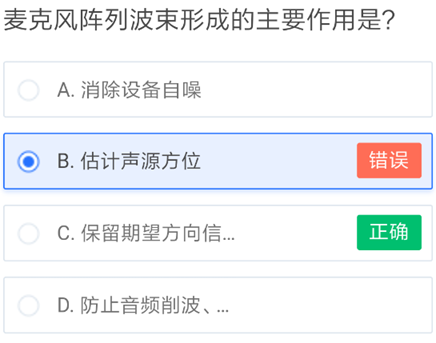
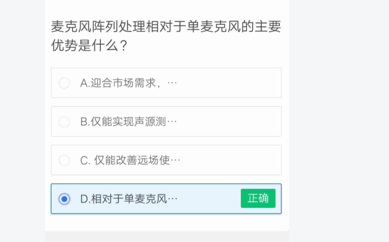

## 以下说法正确的是？  (D)

  A.	采样率对语音识别无影响
  B.	语音识别性能对语速不敏感
  C.	句子错误率是语音识别评价的最重要标准
  D.	语音识别能将特定语言的语音转化为文字  正确

## 以下不属于语音识别系统的模块的是？ (A)

  A.	语义分析  正确
  B.	语言模型
  C.	声学模型
  D.	解码器  错误

## 工作量最大的语音识别优化是？(B)

 A.	语言模型适配
 B.	声学模型适配 正确
 C.	配置特定句式和词典
 D.	调整语音识别解码器参数

## 远讲场景语音识别难度较大，以下哪个说法有错误？(C)

  A.	距离远时，采集到的语音信号自身能量低
  B.	相比近距离，更容易受到房间内各种噪声的干扰
  C.	远距离识别超过了目前语音识别的能力范畴  正确
  D.	房间中，声音遇到墙壁等阻碍物会形成反射，形成混响

## 关于云知声的语音识别公有云，以下说法错误的是？(C)

 A.	支持  8k  和  16k  采样率
  B.	可以选择近讲和远讲两种声学模型
  C.	只能选择一个语言模型  正确
  D.	可以配置个性化数据，比如手机联系人

## 关于ASR，以下说法错误的是？(D)

 A.	远讲声学模型相比近讲声学模型，识别速度要慢
  B.	语言模型的领域选择越多，识别速度越慢
  C.	口音较重时，语音识别性能下降明显
  D.	当前语音识别引擎还不支持中英文夹杂  正确

## 为了优化语音识别的效果，产品开发人员可以做的是？(A)

  A.	通过平台的开发者网站，配置个性化句式和词典  正确
  B.	适配声学模型，使得与真实声音场景更匹配
  C.	适配语言模型，使得与真实语言环境更匹配
  D.	切换语音识别版本，找到最合适的版本  错误

## 一次语音交互流程的顺序是？(c)

  A.	信号处理，语义理解，语音识别，语音合成
  B.	语音识别，语义理解，语音合成，信号处理
  C.	信号处理，语音识别，语义理解，语音合成  正确
  D.	语音合成，信号处理，语音识别，语义理解

## 关于ASR，以下说法错误的是？(D)

  A.	声学模型由数万小时带文字标注的语音数据，训练得到
  B.	通用领域的语言模型由数  T  文本数据训练得到
  C.	连续语音识别部署分为公有云和私有云
  D.	语音识别公有云支持普通话，上海话，闽南语，粤语等  正确

## ASR的首次返回延迟主要应用于以下哪种场景？(C)

  A.	语音转写场景
  B.	实时听写场景  错误
  C.	实时听写输入法类场景  正确
  D.	实时听写IOT类场景

## 合成语音质量的评价方法是？(A)

  A.	人对语音质量进行主观评价  正确
  B.	计算合成语音与标准音的距离
  C.	正确合成文字数目／总文字数目
  D.	合成语音声学参数方差与音库声学参数方差的距离

## TTS MOS 评测最高分为？(B)

  A.	3  分
  B.	5  分  正确
  C.	10  分
  D.	100  分

## TTS MOS 评测维度有？(A,B)

  A.	可懂度  正确
  B.	自然度  正确
  C.	正确率  错误
  D.	召回率

## TTS MOS 评测含义是? (B)

## 下面哪些会影响 TTS 的效果表现？(A,B)

  A.	发音人音色  正确
  B.	技术路线的代数（G1/G2/G3）  正确
  C.	合成模型的训练环境  错误
  D.	合成模型的运行时长

## 下面哪些对合成语音的听感有影响？(ABCD)

  A.	采样率（每秒钟语音含有采样点的个数）  正确
  B.	Opus  编码压缩倍数  正确
  C.	合成语音的语速  正确
  D.	合成语音的播放设备  正确

## 云知声目前已有的 TTS 音色包括？(ABCD)

  A.	男声  正确
  B.	女声  正确
  C.	男童声  正确
  D.	女童声  正确

## 云知声目前 TTS 支持的语种包括？(AB)

 A.	中文  正确
  B.	英文  正确
  C.	日文
  D.	韩文

## 声纹识别引擎实时率计算公式是？(A)

  A.	引擎处理时长/语音时长  正确
  B.	语音时长/引擎处理时长
  C.	测试语音总数/引擎处理时长
  D.	测试人数/引擎处理时长

## 下列关于声纹识别说法正确的是？(AB)

  A.	声纹识别是指利用计算机通过说话人语音判断说话人身份的技术  正确
  B.	声纹识别可分为声纹确认和声纹辨认  正确
  C.	当一段语音包含多个说话人且不同说话人语音没有相互交叠，声纹识别可以识别出该段语音中的每个说话人
  D.	当一段语音包含多个说话人，无论是否存在不同说话人语音相互交叠的情况，声纹识别均可以识别出该段语音中每个说话人

## 关于声纹识别，下列说法正确的是？(A)

  A.	声纹识别能通过说话人语音，识别说话人身份  正确
  B.	声纹识别能通过说话人语音，识别说话人说话内容
  C.	声纹识别能通过说话人语音，判断说话人性别
  D.	声纹识别能通过说话人语音，判断说话人的情感状态

## 声纹识别性能指标——集内辨认准确率计算公式是？(C)

  A.	冒认语音做测试时被判断为真的次数  /  用冒认语音做测试的总次数
  B.	目标说话人语音做测试时被判断为假的次数  /  目标说话人语音做测试的总次数
  C.	测试语音属于目标说话人集合中的说话人且识别结果正确的次数  /  测试语音属于目标说话人集合的测试总次数  正确
  D.	测试语音不属于目标说话人集合中的说话人且识别结果正确的次数  /  测试语音不属于目标说话人集合的测试总次数

## 声纹识别性能指标——集外拒绝准确率计算公式是？(D)

## 关于声纹识别，下列说法正确的是？(AD)

  A.	信噪比越高声纹识别性能越好  正确
  B.	信噪比越低声纹识别性能越好
  C.	口音不会对声纹识别性能造成影响
  D.	口音会对声纹识别性能造成影响  正确

## 关于声纹识别，下列说法正确的是？(BD)

  A.	说话人刻意改变音调不会对声纹识别性能造成影响
  B.	说话人刻意改变音调会对声纹识别性能造成影响  正确
  C.	说话人因感冒导致音色改变不会对声纹识别性能造成影响
  D.	说话人因感冒导致音色改变会对声纹识别性能造成影响  正确

## 关于声纹识别，下列说法正确的是？(C)

  A.	说话人离  mic  距离不会影响声纹识别性能
  B.	不同的房间和混响值不会影响声纹识别性能
  C.	说话人距离  mic  越远则声纹识别性能越差  正确
  D.	说话人正对  mic、侧对  mic  或背对  mic  对声纹识别性能没有影响

## 关于Speaker，下列说法正确的是？(A)

  A.	用户声音画像识别是指计算机通过说话人的语音，识别出说话人的性别和年龄段的技术  正确
  B.	用户声音画像识别是指计算机通过说话人的语音，识别出说话人身份的技术
  C.	用户声音画像识别是指计算机通过说话人的语音，识别出说话人长相的技术
  D.	用户声音画像识别是指计算机通过说话人的语音，识别出说话人情感状态的技术

## 关于Speaker，下列说法正确的是？(BC)

 A.	mic  品质不会对用户声音画像识别性能造成影响
  B.	mic  品质会对用户声音 画像识别性能造成影响 正确
 C.	当 mic 型号相同时，mic 间距会对用户声音画像识别性能造成影响 正确
 D.	当 mic 型号相同时，mic 间距不会对用户声音画像识别性能造成影响

## 关于Speaker，下列说法正确的是？(AC)

 A.	说话人因感冒导致音色改变会对用户声音画像识别性能造成影响 正确
 B.	说话人因感冒导致音色改变不会对用户声音画像识别性能造成影响
 C.	说话人刻意改变音调会对用户声音画像识别性能造成影响 正确
 D.	说话人刻意改变音调不会对用户声音画像识别性能造成影响

## 下列关于用户声音画像识别引擎实时率说法正确的是？(AC)

 A.	CPU 性能直接影响引擎实时率 正确
 B.	引擎实时率只和引擎本身相关，和 CPU 性能无关
 C.	引擎实时率数值越小表示引擎处理能力越强 正确
 D.	引擎实时率数值越大表示引擎处理能力越强

## 关于NLU（自然语言理解），以下哪种说法是正确的？(AB)

 A.	NLU是指从自然语言中解析出语义信息。 正确
 B.	NLU解析自然语言文本，并将其转换为机器可使用的表征形式——语义意图 正确
 C.	语义理解是要理解文本中每一个字的含义，分析语句的语法结构，以方便计算机去使用 错误
 D.	NLU的输入是语音数据，输出是语义意图

## NLU、对话、聊天、问答，四个概念之间的关系，下面说法正确的是？(BCDE)

A.	聊天机器人是对话机器人的一种，聊天和对话没有区别
 B.	NLU是语义理解的简称。 正确
 C.	在语音交互类产品上，对话是指人与机器之间的交互，一般特指基于自然语言的人机口语交互。通过交互，最终实现自己的目的：服务、内容、陪伴等。 正确
 D.	聊天是一个特殊技能(SKILL)，通过对话交互，它主要起陪伴作用 正确
 E.	问答是另外一个特殊技能(SKILL)，通过问答交互，它能够给用户返回有用的知识，一般这些知识都是客观的信息 正确

## 关于提NLU需求的方式，下面哪些做法是正确的？(BCDEF)

 A.	在钉钉上AT到NLU研发人员，并DING一下。
 B.	提禅道任务给NLU的对应产品接口人 正确
 C.	在禅道中写明需求功能定义、示例数据、验收标准 正确
 D.	超过两周工作量的需求，在双方OKR中做对齐 正确
 E.	客户提的需求，及时反馈给NLU，避免因为个人安排失误导致的客户需求无法按时完成。 正确
 F.	个例问题提BUG，功能性批量优化提任务需求，两者不混提。 正确

## NLU Accuracy的计算公式为？(C)

 A.	实际为A意图且判定为A意图的用例数 / 实际为A意图的用例数
 B.	实际为A意图且判定为A意图的用例数 / 判定为A意图的用例数
 C.	理解正确的用例数 / 总用例数 正确
 D.	理解正确的用例数 / 实际为A意图的用例数

## 关于给NLU提BUG，下面哪些做法是正确的？(BCDEGH)

 A.	在钉钉上AT到NLU研发人员，并DING一下
 B.	创建禅道BUG，指派给产品NLU接口人。高优先级BUG，可以钉钉通知该接口人 正确
 C.	在禅道中用URL描述现场、实际的错误输出结果 正确
 D.	在禅道中用写明期望结果、期望解决时间 正确
 E.	需要修复的用例，将用例文本copy到禅道中；必要时一并附上日志文件 正确
 F.	一个类型的BUG，碰到一个提一个，重复提BUG也没事。
 G.	同个类型的BUG，提在同一个禅道BUG当中，区分为一类问题或个例问题 正确
 H.	不同类型的BUG，不混提在同一个禅道BUG中 正确
第35题 得分：0

## 关于语义理解体验的评价，下面哪些说法是正确的？(ACD)

 A.	语义准确率(NLU Accuracy)是评价一个整个NLU系统的指标； 正确
 B.	语义准确率(NLU Accuracy)是评价NLU系统中某个意图的指标；
 C.	评价NLU系统中某个意图的体验，可以用精确率和召回率两个指标来评价； 正确
 D.	评价NLU系统中某个意图的体验，可以用F-Score来评价； 正确

## 关于意图的测评，下面哪些说法是正确的？(CD)

 A.	一个意图的召回率越高，体验越好；
 B.	一个意图的精确率越高，体验越好；
 C.	F-Score同时兼顾了召回率和精确率，因此，F-Score越高代表NLU的体验越好； 正确
 D.	一个意图的召回率和精确率的重要程度可以不同。家居控制意图的精确率比召回率更重要。因为一旦误召回，会产生比较严重的后果(e.g. 一句话误理解为空调制冷有可能导致用户感冒)； 正确

## 以儿童陪伴和教育场景为例，受3~6岁欢迎的语音交互技能应该具备哪些好的特征？(ABCD)

 A.	语音友好性：语音交互的说法，容易说出口，识别率高，不容易出错，没有奇异性。 正确
 B.	寓教于乐：有知识教育性、有竞赛娱乐性。 正确
 C.	简单性：内容简单，最好是现实生活中就有的客观常见需求；内容不过于复杂高深，不过多超越儿童的知识储备。 正确
 D.	个性化：能够根据小朋友的个性化需求和信息，进行交互。比如，在应答中偶尔说出小朋友的名字。 正确
 E.	难度高：难度越高，越能体现技能的高超水平，越能收到小朋友的欢迎

## 关于一个技能的开发，下面说法正确的是？(ABC)

 A.	技能开发，重中之重是要定义好技能协议。这要求设计者对需求的理解足够深刻，能够较好的抽象出需求中的事物的概念模型，并设计出合理的意图协议。 正确
 B.	技能开发要同时合理的使用关键词、模板句式、词典、复述语料，不可偏废其一。 正确
 C.	技能开发是个动态的过程，包含冷启动和在线运营两个阶段。有了真实日志语料以后，技能的持续在线更新运营会变得更加容易，投入产出比更高。 正确
 D.	技能开发时，关键词和模板句式实施没有科技含量，没有理论依据，不如时下流行的深度学习好用，编辑模板是个体力活，应该废弃掉。

## 关于开发者网站的用法，下面做法正确的是？(BCE)

 A.	技能关联越多越好，不管现在有没有用到，关联上就行了，反正也没什么坏处。
 B.	技能关联要按需操作，不是越多越好，产品经理要非常熟悉每个技能的功能边界。盲目关联技能，会引起不必要的意图理解冲突，或者意图理解了但应用层没有接入。最终给产品交互带来负面影响。 正确
 C.	每个业务团队有一个明确的开发者账号Owner。开发者网站的账户和密码，需要妥善保管，不可随意给到别的同事。Owner离职时，开发者账号和配置要办理交接。 正确
 D.	每个业务团队管理的开发者网站上的配置项，可以多做配置尝试。一旦错了，再改回来就可以了。
 E.	技能关联与测试环境形成对应，测试内网时需要由账号owner关联内网环境中的服务；测试外网时需要由账号owner关联外网环境中的服务；测试uat环境时需要找张大康关联uat环境中的服务。 正确

## WER数值越低，说明ASR服务的性能？(B)

 A.	越差
 B.	越好 正确
 C.	不变
 D.	没有关系
第41题 得分：1

## 对于ASR测试，在相同的引擎、模型、配置、测试数据前提下，以下哪些说法是正确的？(BD)

 A.	在相同的硬件上多次运行可能产生不同的结果
 B.	在相同的硬件上多次运行一定产生相同的结果 正确
 C.	在不同的硬件上运行一定产生相同的结果
 D.	在不同的硬件上运行可能产生不同的结果 正确
第42题 得分：1

## 以下哪种测试，不属于基础服务的常规测试范畴？(D)

 A.	功能测试
 B.	性能测试
 C.	稳定性测试
 D.	强度测试 正确
第43题 得分：1

## 测试报告中，一般要包含以下哪些要素？(ABCD)

 A.	测试需求和目的 正确
 B.	测试结论 正确
 C.	测试环境 正确
 D.	测试人员和日期 正确
第44题 得分：1

## 研究语音的时频分析特性，将时域语音信号经过傅里叶变换而得到的显示图形称为？(A)

 A.	语谱图 正确
 B.	波形图
 C.	波束图
 D.	倒谱图
第45题 得分：1

## AEC在SSP引擎中所起的作用主要是？(D)

 A.	环境噪声干扰抑制
 B.	房间混响抑制
 C.	说话人测向
 D.	声学回声消除 正确

## 在AEC处理中, 通常需要在特定的SER下去量化对比性能,  否则由不同设备, 不同播放的内容, 不同播放音量等因素, 会导致比对的时候不在同一纬度上.  这其中的SER指的是? (C)

## 在多mic板卡中，为保证产品的使用效果，我们通常要求mic间具备良好的灵敏度一致性，具体的一致性指标是不同mic间灵敏度差异小于？(B)

 A.	1dB
 B.	3dB 正确
 C.	5dB
 D.	7dB
第47题 得分：1

## 声学回声消除与硬件设备的结构有十分紧密的关系，良好的硬件设计可以让算法的性能得到有效保证，以下哪些因素是硬件结构设计中需要重点考量的量？(ABCD)

 A.	良好的声学器件特性，如mic、喇叭在工作频段内具备十分良好的频响曲线； 正确
 B.	结构设计应尽可能的避免谐波、震动等因素的干扰； 正确
 C.	设备应该具备良好的密封性，减少内部声音传导； 正确
 D.拾音器的安装，不应该引入腔体等结构干扰； 正确
第48题 得分：1

## 麦克风阵列波束形成的主要作用是？(C)

 A. 消除设备自噪
 B.估计声源方位
 C.保留期望方向信号并抑制其他方向干扰和噪声 正确
 D.防止音频削波、数据篡改、数据丢失
第49题 得分：1

## 关于声源测向，下列说法正确的是？(BC)

 A.单个麦克风能完成声源测向
 B.麦克风阵列能完成声源测向 正确
 C.麦克风阵列实际接收信号顺序与SSP引擎定义的麦克风顺序要完全一致，否则不能正常测向 正确
 D.麦克风阵列实际接收信号顺序与SSP引擎定义可以不一致
第50题 得分：1

## 关于混响，下列说法正确的是？(ABD)

 A.声源停止发声后，声波会在房间内经多次反射和吸收后才会消失，给人们的主观感觉是有若干个声波混合持续一段时间，这种现象叫做混响 正确
 B.	混响时间指的是反射声能量比直达声能量衰减60dB所需要的时间 正确
 C.	房间混响不会影响SSP引擎AEC、降噪、声源测向等性能
 D.房间混响越大，对SSP引擎性能影响也越大 正确
第51题 得分：1

## SSP引擎要求麦克风位置误差不超过？(B)

 A.±0.3mm
 B.±1mm 正确
 C.±5mm
 D.±10mm

## 声纹识别识别性能指标—虚警计算公式是？(A)

## 关于声纹识别，下列说法正确的是？(AD)

## 关于声纹识别，下列说法正确的是？(BC)

## 关于声纹识别，下列说法正确的是？(BD)

## 测试人员A和B正在进行某APP声纹锁体验测试，A使用自己的语音完成声纹注册后B尝试进行声纹登录，共尝试20次，其中成功登录1吃，请问在该次体验测试中，该声纹锁的虚警为？(D)

## 测试人员A正在进行某APP声纹锁体验测试，A使用自己的语音完成声纹注册后并尝试进行声纹登录，共尝试20次，其中成功登录19吃，请问在该次体验测试中，该声纹锁的漏警为？(D)

## 用户声音画像识别性别指标—类别识别准确率计算公式是？(A)

## 用户声音画像识别引擎实时率计算公式是？(A)

## 关于给NLU提BUG，下面哪些说法是正确的？(BCDEGH)

## 关于项目落地中的NLU需求，下面哪些做法是正确的？(BCD)

## 关于AI产品的NLU SanityTest，下面做法错误的是？(ABC)

## 有市场竞争力的产品NLU测评体系，是有哪几部分构成的？(ABCDE)

## 关于NLU协议的协议变更和版本升级，下面说法正确的是?(ABCD)

## 关于NLU请求中的场景参数（scenario），下面说法正确的是？(ABCD)

## 关于如何定位是否为NLU的问题，下面做法正确的是？(BCD)

## 首字节返回时间常用于以下哪项服务的测试指标？通常情况下需要小于多少ms？(D)

## 以下哪些是NLU服务的测试指标？(AC)

## 对于测试报告的注意事项，以下哪些说法是正确的？(ABCD)

## SSP引擎的主要作用包括？(ABCDE)

## 在理想声学环境下，说话人离拾音设备的距离每增加一倍，声压级会随之下降？(B)

## 对于均匀线型麦克风阵列，下列哪个表示阵列间距？(A)

## 麦克风阵列失配误差包括？(ABC)

## 麦克风阵列波束形成的主要作用是？(C)

## SSP引擎中DOA实现的功能是？(A)

## SSP引擎中麦克风接收信号包括哪些？(ABCD)

## 语音识别通常的评价标准是?(AC)

## 语音识别结果中插入错误很高，最可能的情况是？(B)

## 以下哪种情境对语音识别来说最难？(D)

## 以下不属于语音识别系统的模块的是？(A)

## 远近场景语音识别难度较大，以下哪个说法有错误？(C)

## 关于当前的语音识别公有云，以下说法错误的是？(A)

## 关于ASR，以下说法错误的是？(C)

## 以下不会明显影响语音识别结果的是？(B)

## ASR的首次返回延迟主要应用于以下哪种场景？(C)

## 关于ASR，以下说法正确的是？(D)

## 下面哪些是TTS的评价手段？(AB)

 

## TTS MOS评测最高分为？(B)

## TTS工程指标包括？(ABC)

## TTS首帧返回时间的含义是? (C)

## 如何计算TTS并发？(B)

## 云知声目前已有的TTS音色包括？(ABCD)

## 目前云知声支持多少句语音的个性化TTS定制？(ABCD)

## 关于声纹识别，下列说法正确的是？(AD)

## 关于声纹识别，下列说法正确的是? (AD)

## 关于声纹识别，下列说法正确的是？(BD)

## 关于声纹识别，下列说法正确的是？(BC)

## 下列哪些统计量是声纹识别性能衡量指标？(AB)

## 关于Speaker，下列说法正确的是？(BC)

## 下列关于用户声音画像识别引擎实时率说法正确的是？(AC)

## 关于Speaker，下列说法正确的是？(AD)

## 完整的口语对话系统，包含哪些模块？(ABCE)

## 关于提NLU需求的标准，下面哪些做法是正确的？(CD)

## 关于语义理解体验的评价，下面哪些说法是正确的？(AC)

 

## 关于意图的评测，下面哪些说法是正确的？(CD)

## 关于项目落地中的NLU的价值发挥，下面哪些做法是正确的？(BCDE)

## 关于一个技能的开发，下面说法正确的是？(ABC)

## 对于ASR测试，在相同的引擎、模型、配置、测试数据前提下，一下哪些说法是正确的？(BD)

## 对于VPR（声纹识别），以下哪种解释是正确的？(B)

## 对于Speaker（用户声音画像识别），以下哪种解释是正确的？(A)

## SSP引擎中麦克风阵列声源定位会受哪些因素影响？(ABCD)

## 常见的语音质量问题包括？(ABC)

 

## 关于混响，下列说法正确的是？(ABD)

## 语音识别通常的评价标准是？(AC)

## 关于ASR，字错误率不包含以下哪一种错误？ (C)

## 以下对ASR并发描述正确的是？(ABCD)

## 关于ASR，以下说法正确的是？(D)

## TTS的含义是？ (C)

## 下面哪些是TTS的评价手段？(AB)

## 下面哪些会影响TTS的效果表现？(AB)

## TTS工程指标包括？(ABC)

## TTS在线合成引擎引擎支持下面哪些调整？(ABCD)

## 声纹识别性能指标—漏警计算公式是？(B)

## 关于声纹识别，下列说法正确的是？(B)

## 声纹识别由下列哪几部分组成? (BC)

## 如果你是一个AI产品经理, 如何确保你产品已经上线的NLU功能表现基本稳定, 而不出致命错误? (ACDE)

## "末次返回延迟" 常用于以下哪项服务的测试指标. 通常情况下小于多少ms? (A)

## 对于KRC (知性会话), 以下哪种解释是正确的? (D)

## 信号处理中, 信噪比(SNR) 是一个非常重要的概念, SNR 0db是指? (C)

## 麦克风阵列处理相对于单麦克风的主要优势是什么? (D)

## 以下关于麦克风阵列的间距, 拓扑结构的说法 正确的是? (A)

## 对于如下圆形麦克风阵列, 下列哪个方向表示0度方向? (D)

## 语音压缩对语音识别性能影响怎么样? (C)

## 提禅道任务,  要求优化语音识别效果时, 不需要提供? (B)

## 下列关于声纹识别引擎实时率说法正确的是? (AC)

## 关于ASR, 以下对于功能配置描述正确的是? (B)

## 若发现SSP引擎输出DOA存在固定偏差, 首先应该排查什么问题? (C)

## 统计WER结果时, 所统计的错误类型一般包括以下哪些? (ABC)

## NLU的F-Score计算公式中, 当权重β=0.5时, 以下说法正确的是? (B)

